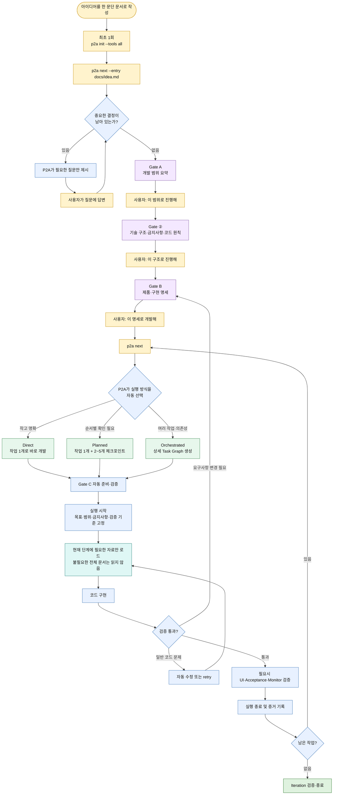
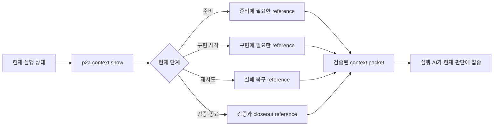

# Adaptive P2A Harness 사용자 개발 흐름

이 문서는 Plan2Agent를 처음 도입하는 사용자가 Gate 승인부터 adaptive 실행·검증·종료까지의 전체 여정을 한눈에 이해하기 위한 개요다. 정확한 명령과 옵션은 [Quickstart](quickstart.md)와 [CLI 사용자 가이드](cli-reference.md), 산출물 계약은 [하네스 사용자 가이드](harness-guide.md)를 따른다.

## 한 줄 요약

사용자는 `p2a next`를 반복하고, 제품의 범위나 의미를 결정하는 Gate에서만 명시적으로 승인한다. 실행 방식 선택, 필요한 컨텍스트 로딩, 일반적인 구현·수정·검증은 P2A와 실행 AI가 담당한다.

## 전체 흐름



색상은 다음 역할을 나타낸다.

- 노란색: 사용자가 직접 하는 일
- 보라색: 사용자의 명시적 승인이 필요한 Gate
- 파란색·초록색: P2A와 실행 AI가 자동 처리하는 일

## 실행 방식 선택

새 프로젝트의 기본 실행 정책은 `adaptive`다. Gate B가 승인되면 실행 AI가 승인된 명세와 저장소 상태를 확인하고 다음 세 방식 중 하나를 선택한다. 사용자는 이 선택이나 Gate C 준비를 별도로 승인하지 않는다.

| 방식 | 선택되는 경우 | 실제 동작 |
| --- | --- | --- |
| Direct | 작고 명확하며 한 번의 검증으로 끝낼 수 있는 변경 | 하나의 compatibility work item을 바로 구현하고 검증한다. |
| Planned | 한 명이 구현하지만 순서별 복구 지점이 필요한 변경 | 하나의 work item을 2~5개의 ordered checkpoint로 나누고 각 checkpoint를 명령으로 검증한다. |
| Orchestrated | 여러 작업, 의존성, 소유권 분리 또는 격리가 필요한 변경 | dependency-aware Task Graph를 만들고 준비된 작업부터 실행한다. |

기존 설정에 `executionMode`가 없으면 호환성을 위해 `orchestrated`로 해석한다.

## 사용자가 기억할 최소 명령

### 최초 설치와 초기화

```bash
npm install -g plan2agent
cd <project-dir>
p2a init --tools all --codex-profile quality
```

### 아이디어 전달

```bash
p2a next --entry docs/idea.md
```

Codex나 Claude의 Agent 세션에서는 다음처럼 시작할 수 있다.

```text
/p2a-next --entry docs/idea.md
```

### Gate 승인 후 계속 진행

```bash
p2a next
```

각 행동이 끝날 때마다 `p2a next`를 다시 실행하면 현재 상태에서 필요한 다음 행동 하나를 안내한다.

## 사용자가 직접 결정하는 지점

### Gate A: 범위 승인

P2A가 사용자, 목표, 범위, 제약, 제외 항목을 요약한다. 사용자는 이 요약이 의도와 맞는지 확인한다.

```bash
p2a decide \
  --artifacts .plan2agent/artifacts/<project_id> \
  --entry docs/idea.md \
  --quote "이 범위로 진행해"
```

### Gate ②: 프로젝트 원칙 승인

아키텍처, 기술 스택, 금지사항과 코드 스타일을 담은 constitution을 검토한다.

```bash
p2a shape approve --quote "이 구조로 진행해"
```

### Gate B: 제품·구현 명세 승인

모든 미해결 결정을 닫고 제품 요구사항, 구현 범위, acceptance criteria와 verification을 검토한다. 화면이 있는 작업은 이 단계에서 visual experience와 prototype도 함께 승인한다.

```bash
p2a decide \
  --artifacts .plan2agent/artifacts/<project_id> \
  --quote "이 명세로 개발해"
```

## Gate B 이후 P2A가 자동 처리하는 일

1. `p2a next`가 현재 상태와 실행 준비 행동을 반환한다.
2. 실행 AI가 Direct, Planned 또는 Orchestrated를 선택한다.
3. Gate C가 선택된 mode에 맞는 work item, checkpoint 또는 dependency를 검증한다.
4. `p2a execute start`가 Gate B에서 파생한 execution envelope를 source hash와 함께 고정한다.
5. Direct/Planned 실행은 현재 단계에 필요한 canonical reference만 context packet으로 읽는다.
6. 실행 AI가 코드를 구현하고 일반적인 코드·테스트·UI drift를 스스로 수정한다.
7. Planned는 각 checkpoint를 순서대로 검증한다.
8. 필요한 테스트와 선택된 visual, acceptance 또는 monitor 검증을 수행한다.
9. `p2a execute finish`가 검증 결과, 변경 파일과 실행 증거를 기록한다.
10. 남은 작업이 있으면 다시 `p2a next`, 모두 끝났으면 iteration을 검증하고 닫는다.

## 새 컨텍스트 라우팅의 의미

Direct/Planned 실행에서는 모든 지침과 참고 문서를 프롬프트에 미리 넣지 않는다. P2A는 `prepare`, `owner-start`, `retry`, `verify-closeout` 등 현재 실행 단계에 맞는 reference만 선택해 제공한다.



Context packet은 reference의 route ID, 경로, SHA-256과 byte boundary를 함께 제공한다. 하지만 새로운 승인, 쓰기 권한, 배포 권한 또는 비용 사용 권한을 부여하지는 않는다.

## 실패했을 때

- 일반적인 구현 또는 테스트 실패: 같은 승인 범위 안에서 AI가 수정하거나 retry한다.
- Planned checkpoint 실패: 실패 증거를 보존하고 새 retry run으로 이어간다.
- 제품 의미, acceptance criteria, 승인 범위 또는 외부 권한을 바꿔야 함: 자동으로 확장하지 않고 Gate B로 돌아가 사용자 승인을 다시 받는다.
- 모든 작업 완료: close-ready validation을 통과한 뒤 iteration을 닫는다.

```bash
p2a iteration validate \
  --artifacts .plan2agent/artifacts/<project_id> \
  --require-close-ready

p2a iteration close \
  --artifacts .plan2agent/artifacts/<project_id>
```

## 최종 사용 원칙

사용자는 다음 세 가지만 기억하면 된다.

1. 아이디어를 짧은 문서로 작성한다.
2. `p2a next`가 안내하는 Gate에서만 의도를 명확히 승인한다.
3. 승인 후에는 실행 방식 선택과 일반적인 구현·검증을 P2A에 맡긴다.
