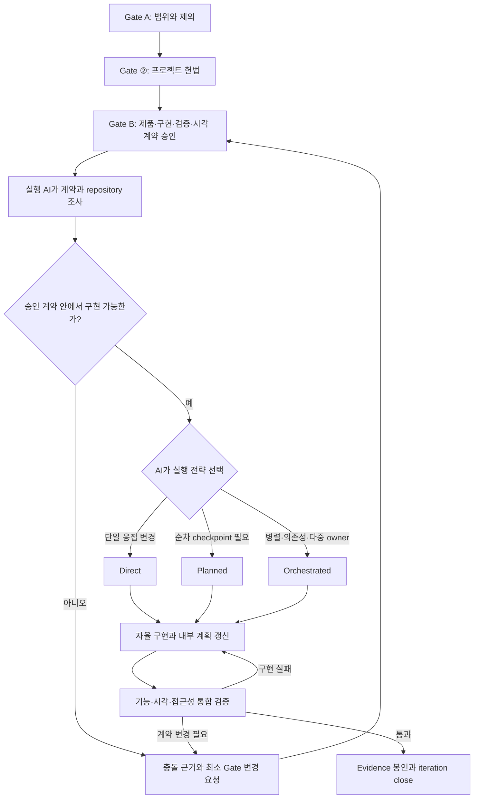

# 승인된 계약 기반 자율 개발 개선안

작성일: 2026-08-13<br>
상태: 설계 제안 — 현재 동작이 아님

문서 홈: [Plan2Agent Docs](README.md) · 현재 구현 계약: [하네스 구현 기준](harness-spec.md) · [반복 개발 스펙](iteration-spec.md) · [감독형 실행 레퍼런스](supervised-execution.md)

## 1. 최상위 개선 목표

Plan2Agent의 단일 최상위 개선 목표는 **승인된 계약 기반 자율 개발(Contract-driven Autonomous Development)** 이다.

> 사용자는 무엇을 왜 만들지 승인하고, 하네스는 기획 계약의 완전성·일관성·추적성을 검증한다. AI는 승인된 계약과 프로젝트 규칙 안에서 구현 방법을 자율적으로 결정하고, 실제 검증을 통과할 때까지 개발한다.

정상 흐름에서는 Gate B 승인 이후 사용자가 task, 파일, 코드 구조나 구현 순서를 다시 지시하지 않는다. 실행 AI가 repository와 승인 계약을 직접 읽고 내부 계획을 세우며, 구현·테스트·렌더링·수정 반복을 거쳐 close-ready 상태까지 책임진다. 제품 의미나 승인 경계를 바꿔야 할 때만 정확한 충돌과 필요한 결정을 제시하고 Gate로 돌아온다.

### 권한과 책임

| 주체 | 권한과 책임 | 하지 않는 일 |
| --- | --- | --- |
| 사용자 | 목표, 범위, non-goal, UX, 중요한 trade-off와 acceptance 계약을 승인한다. | 파일별 구현 방법이나 AI의 내부 실행 계획을 일상적으로 승인하지 않는다. |
| 하네스 | 기획을 구조화하고 누락·충돌·근거·hash·승인 lineage를 검증하며 실행 가능한 계약으로 전달한다. | 사용자 대신 제품 결정을 승인하거나 구현 recipe를 task로 미리 고정하지 않는다. |
| 실행 AI | repository 조사, 내부 작업 분할, 파일·구조·도구 선택, 구현, 테스트, 렌더링, self-review와 수정 반복을 소유한다. | 승인된 제품 의미, project constitution, 권한·안전 경계를 임의로 변경하지 않는다. |
| Validator/reviewer | 기계 규칙과 실제 기능·시각·접근성 evidence를 독립적으로 검사한다. | 제품 결정을 새로 만들거나 evidence 없이 완료를 추정하지 않는다. |

### AI가 자율적으로 결정하는 범위

- 승인 목표를 달성하기 위한 내부 작업 순서와 분할
- 수정할 파일, 함수·component 구조와 기존 pattern 재사용 방식
- 승인된 stack 안에서의 구체적인 구현 대안
- 필요한 테스트와 fixture 추가, 실패 원인 수정
- UI render 결과에 따른 implementation drift 수정
- 현재 scope 안에서의 refactoring과 실행 모드 변경
- 허용된 provider 도구와 bounded subagent 사용

여러 구현 대안이 존재한다는 이유만으로 사용자에게 선택을 넘기지 않는다. AI는 repository evidence, constitution, Gate B acceptance와 검증 비용을 근거로 가장 적절한 방식을 선택하고 그 근거를 run evidence에 남긴다.

### AI가 중단하고 Gate로 돌아오는 조건

- 목표, 사용자 흐름, acceptance 또는 non-goal을 변경해야 한다.
- 승인 범위 밖의 기능이나 dependency가 필요하다.
- project constitution의 아키텍처, foundational stack, prohibition 또는 style 변경이 필요하다.
- 보안, 개인정보, 데이터 보존·migration 의미가 승인 계약과 달라진다.
- 되돌리기 어려운 외부 write, 배포, 비용 발생 또는 새 권한이 필요하다.
- 상충하는 Gate 근거 때문에 어느 구현도 계약을 만족할 수 없다.

Gate 복귀 보고는 막연한 질문이 아니라 충돌한 source field, repository evidence, 가능한 선택지와 trade-off를 포함한 최소 변경 요청이어야 한다. 일반 구현 실패, 테스트 실패와 UI drift는 Gate 복귀 사유가 아니며 AI가 같은 실행 안에서 수정한다.

### 후속 변경안 판단 기준

모든 schema, CLI, skill과 agent 변경은 다음 질문으로 우선순위를 판정한다.

- 사용자가 승인할 기획 계약을 더 명확하게 만드는가
- 승인 이후의 불필요한 사용자 개입과 구현 micromanagement를 줄이는가
- AI가 scope 안에서 계획·구현·검증을 끝까지 소유하게 하는가
- 자율성을 늘리면서도 rule violation과 근거 없는 완료를 더 강하게 차단하는가

어느 항목에도 기여하지 않는 compatibility layer, task field, prompt rule 또는 review pass는 기본 경로에서 제거하거나 조건부로 내린다.

## 2. 결정 요약

Plan2Agent의 개발 계약 정본은 승인된 Gate 산출물로 둔다. Task는 Gate의 목표와 제약을 다시 서술하거나 구현 방법을 미리 결정하는 문서가 아니라, 필요한 경우에만 실행 순서·의존성·병렬 소유권·상태를 기록하는 얇은 실행 단위로 축소한다.

목표 구조는 다음과 같다.

- Gate A는 문제, 사용자, 범위, 제외 항목을 확정한다.
- Gate ②는 프로젝트 전체에 지속되는 아키텍처, stack, 금지사항, style을 확정한다.
- Gate B는 제품 동작, 구현 제약, acceptance criteria, 검증 전략과 필요한 시각 경험을 승인한다.
- Gate C는 항상 task graph를 만드는 단계가 아니라 **실행 방식과 실행 준비 상태를 검증하는 선택형 단계**로 바꾼다.
- 실행 agent는 승인된 Gate 계약과 현재 repository를 직접 읽고, 그 안에서 가장 응집된 구현 단위를 결정한다.
- 안전, 승인, 검증, 증거 보존 기준은 사용하는 모델 등급이나 실행 방식과 관계없이 유지한다.

Task를 전부 없애는 것이 목표는 아니다. 단일 agent가 한 번에 끝낼 수 있는 변경에는 task 저작을 생략하고, 여러 실행 주체·명확한 선후 관계·장기 재개가 필요한 경우에만 task 또는 task graph를 사용한다.

## 3. 현재 구현에서 확인된 사실

아래 내용은 개선 가설이 아니라 현재 repository 계약에서 직접 확인되는 사실이다.

| 확인 사항 | 현재 상태 | 근거 |
| --- | --- | --- |
| 개발 실행 전 task graph | canonical task graph 검증을 실행 진입의 필수 조건으로 둔다. | [`p2a-harness` 역할/검증 계약](../.agents/skills/p2a-harness/SKILL.md), [감독형 실행 안전 정책](supervised-execution.md#8-안전-정책) |
| 권장 task 개수 | 의미 있는 iteration을 보통 10~50개의 작은 task로 나누도록 지시한다. 이 수치는 schema 제약이 아니라 저작 지침이다. | [`p2a-task-author`](../.agents/skills/p2a-task-author/SKILL.md), [`task-graph.schema.json`](../schemas/task-graph.schema.json) |
| task 중복 서술 | 각 task에 `description`, `acceptanceCriteria`, `suggestedAgentPrompt`, `sourceSpecRefs`를 모두 요구한다. | [`task-graph.schema.json`](../schemas/task-graph.schema.json) |
| 구현 agent 단위 | implementer 역할은 정확히 한 ready task를 구현하도록 고정되어 있다. | [`p2a-implementer`](../.agents/agents/p2a-implementer.md) |
| UI 최종 review 기본값 | `devExecution.reviewPasses.visual` 기본값은 `off`다. | [감독형 실행 리뷰 패스 정책](supervised-execution.md#리뷰-패스-정책) |
| 개발 중 시각 검수 | task-level 사용자 시각 검수는 비게이팅·무기록 절차다. | [개발 중 사용자 시각 검수](supervised-execution.md#개발-중-사용자-시각-검수) |
| 현재 eval 범위 | stable metrics에는 모델별 성공률, task 크기, prompt 길이, first-pass acceptance, UI drift가 없다. | [`eval/stable-metrics.json`](../eval/stable-metrics.json) |

따라서 다음 주장은 아직 실험으로 입증된 사실이 아니라 검증할 설계 가설이다.

- 긴 task prompt를 줄이면 최신 상위 모델의 성능이 좋아진다.
- task 수를 줄이면 중간급 모델의 통합 오류가 감소한다.
- Gate 중심 Direct 실행이 현재 graph 실행보다 비용과 시간이 적게 든다.
- 통합된 render/review loop가 UI 품질을 개선한다.

기본값을 바꾸기 전에 §13의 비교 평가로 이 가설을 검증해야 한다.

## 4. 현재 구조의 문제

### 4-1. 같은 계약이 여러 위치에 반복된다

Gate B가 이미 목표, 요구사항, 구현 계획과 검증 전략을 소유하지만 task는 이를 `description`, acceptance criteria, prompt로 다시 풀어 쓴다. 이 과정에서 다음 문제가 생길 수 있다.

- 승인된 spec과 task prompt 사이의 의미 drift
- 긴 prompt 안에서 중요한 non-goal과 제약의 가시성 저하
- task마다 반복되는 전역 규칙으로 인한 context 사용량 증가
- 구현 전에 파일과 순서를 고정해 repository 조사 결과를 반영하기 어려움

### 4-2. task 개수 자체가 품질 기준처럼 작동한다

`10~50 task`는 추적이나 병렬 실행이 필요한 큰 iteration에는 유용할 수 있지만, 작은 vertical slice에도 같은 기준을 적용하면 기능 맥락이 여러 run으로 분리된다. Task 개수는 품질 지표가 아니다. 분리는 다음 조건으로 결정해야 한다.

- 독립적으로 검증 가능한 결과인가
- 별도 실행 주체가 소유해야 하는가
- 실제 선후 의존성이 있는가
- 실패 시 독립 rollback 또는 재개 지점이 필요한가
- 한 실행 context 안에서 다루기 어려울 만큼 범위가 큰가

### 4-3. 최신 모델의 repository 판단 능력을 사용하기 전에 구현 방법을 고정한다

현재 task author는 제한된 `code_signals`와 Gate B를 이용해 구현 단계를 먼저 결정한다. 실제 구현 agent가 전체 코드, 테스트, 기존 관례를 조사한 뒤 더 나은 경계를 찾더라도 승인된 task 밖으로 나가지 않도록 요구된다. 이는 안전한 scope 제한에는 도움이 되지만, task가 지나치게 세밀하면 합리적인 통합 변경까지 scope 위반처럼 만들 수 있다.

### 4-4. UI 계약과 구현 loop가 분리되어 있다

UI task에는 가벼운 `visualImpact`가 전달되지만, 실제 품질은 승인된 전체 화면·상태·viewport 조합과 통합된 application render에서 판정해야 한다. 동시에 최종 visual review 기본값은 `off`이고 개발 중 검수는 기록되지 않는다. 이 조합에서는 task가 모두 완료되어도 전체 화면의 위계, 일관성, responsive 동작과 사용자 흐름이 깨질 수 있다.

## 5. 설계 원칙

### 5-1. Gate는 의미 계약, 실행 계획은 운영 메타데이터다

Gate에는 다음 내용을 둔다.

- 무엇을 만들어야 하는가
- 사용자가 어떤 결과를 얻어야 하는가
- 무엇을 만들지 말아야 하는가
- 어떤 제약을 지켜야 하는가
- 무엇을 관찰하면 완료라고 판단하는가
- 어떤 기능·시각·접근성 검증을 통과해야 하는가

실행 계획에는 다음 내용만 둔다.

- 어떤 실행 단위가 존재하는가
- 병렬 실행 또는 선후 관계가 있는가
- 누가 어떤 범위를 소유하는가
- 현재 상태와 검증 evidence가 무엇인가

### 5-2. 상세함과 명확함을 구분한다

다음 정보는 모델 등급과 관계없이 명시한다.

- 목표와 사용자 관점의 결과
- 승인된 source reference와 hash
- 범위와 non-goal
- 보존해야 하는 기존 동작
- 관찰 가능한 acceptance criteria
- 검증 명령과 시각 확인 matrix
- 추측하지 않고 중단해야 하는 조건

다음 정보는 정형 변환이나 안전상 순서가 중요한 경우가 아니면 구현 agent가 결정한다.

- 수정할 파일의 완전한 목록
- 함수와 class의 내부 분할
- 코드 작성 순서
- 세부 구현 recipe
- 임의의 task 개수 목표

### 5-3. 기계 규칙은 prompt가 아니라 CLI가 강제한다

Schema, hash, 승인 lineage, 경로 경계, 상태 전이, evidence 형식, dependency cycle은 validator와 CLI가 검사한다. Agent prompt에는 같은 규칙의 전문을 반복하지 않고 실패 시 필요한 메시지와 source reference만 제공한다.

### 5-4. 자율성은 무검증이 아니라 실행 책임이다

AI의 자율성은 규칙을 생략하거나 결과를 self-report만으로 승인한다는 뜻이 아니다. AI가 구현 선택과 실패 수정을 끝까지 책임지되, 권한 경계와 완료 판정은 외부 validator와 실제 실행 evidence가 강제한다는 뜻이다.

Gate B 승인 뒤 사용자 개입이 없는 것이 목표지만, 다음 두 결과는 명확히 구분한다.

- 구현 실패: AI가 계획을 바꾸고 재시도한다.
- 계약 실패: AI가 정확한 Gate 변경 요청과 함께 중단한다.

### 5-5. 모델이 아니라 작업 특성으로 실행 모드를 고른다

상위 모델이라고 항상 큰 작업을 주거나, 중간급 모델이라고 항상 많은 task로 나누지 않는다. 결합도, 위험, 병렬성, 재개 필요성과 검증 가능성이 실행 모드를 결정한다. 모델 profile은 같은 계약을 얼마나 자세히 보여줄지 정하는 보조 신호로만 사용한다.

## 6. 목표 workflow



Gate B 승인 뒤 `p2a next`의 정상 행동은 task authoring이나 구현 선택 질문이 아니라 자율 개발 session 시작이다. 실행 AI가 repository 조사 후 모드를 선택하고 필요하면 같은 승인 scope 안에서 바꾼다. 모드 선택은 새로운 사람 승인 Gate가 아니다. 사용자는 비용·권한·병렬성 같은 운영 정책으로 허용 범위를 제한할 수 있으며, 판정이 애매하면 AI는 더 보수적인 모드를 선택한다.

## 7. 세 가지 실행 모드

세 모드는 사용자가 작성해야 하는 계획 종류가 아니라 실행 AI가 목표를 완수하기 위해 선택하는 내부 운영 전략이다. 하네스는 선택 근거와 mode별 계약을 검증하지만 정상적인 mode 선택을 사용자에게 다시 묻지 않는다.

| 모드 | 적용 조건 | 계획 산출물 | 실행 단위 |
| --- | --- | --- | --- |
| `direct` | 단일 owner, 응집된 vertical slice, 독립 병렬화 이점이 작음 | Gate B를 참조하는 얇은 execution record | iteration run 1개 |
| `planned` | 한 owner가 수행하지만 2~5개의 순차 checkpoint와 재개 지점이 필요함 | milestone 목록과 각 검증 조건 | milestone 단위 |
| `orchestrated` | 여러 owner/agent, 실제 dependency branch, 격리 병렬 작업 또는 독립 rollback 필요 | dependency-aware task graph | ready task 또는 bounded batch |

### 7-1. Direct

Direct가 기본 후보가 되는 예시는 다음과 같다.

- 하나의 사용자 흐름을 frontend와 backend까지 함께 완성하는 작은 기능
- 한 화면의 구조와 interaction을 통합해서 수정하는 UI 개선
- 한 agent가 현재 context 안에서 구현과 검증을 끝낼 수 있는 변경

Direct에서도 승인 Gate, run log, verification evidence, visual review와 close 조건은 생략하지 않는다. 생략하는 것은 사람이 저작한 세부 task graph뿐이다.

현재 v1 task 기반 실행기와 호환하는 과도기에는 CLI가 Gate B를 참조하는 단일 synthetic work item을 생성할 수 있다. 이 레코드는 상세 구현 prompt를 저장하지 않으며 사용자 산출물인 task graph로 취급하지 않는다.

### 7-2. Planned

Planned는 task 대신 결과 중심 milestone을 사용한다.

```json
{
  "mode": "planned",
  "objective": "승인된 구매 흐름을 end-to-end로 구현한다.",
  "source_gate_refs": ["gate-b-spec/spec.json"],
  "milestones": [
    {
      "id": "milestone-1",
      "outcome": "핵심 구매 흐름이 application에서 동작한다.",
      "verification": ["관련 integration test"]
    },
    {
      "id": "milestone-2",
      "outcome": "승인된 화면 상태와 responsive matrix가 통과한다.",
      "verification": ["visual contract review"]
    }
  ]
}
```

Milestone은 파일별 구현 recipe가 아니며, 이전 milestone의 내부 구현을 다음 milestone이 다시 서술하지 않는다.

### 7-3. Orchestrated

다음 조건 중 하나라도 해당하면 task graph를 유지한다.

- 둘 이상의 write owner가 동시에 작업한다.
- 독립 branch를 병렬화했을 때 명확한 시간 이점이 있다.
- migration, 배포, API 전환처럼 실제 선후 관계가 존재한다.
- 실패 격리나 부분 rollback 단위가 필요하다.
- 장기 작업이라 여러 session에서 소유권과 재개 상태를 보존해야 한다.

이 모드에서도 `10~50` 같은 고정 개수 기준은 사용하지 않는다. 각 task는 독립적으로 검증할 수 있는 결과와 실제 dependency를 가질 때만 만든다.

## 8. 얇은 실행 계약

모드와 관계없이 runtime에는 다음 최소 envelope를 전달한다.

```json
{
  "objective": "이번 실행에서 완성할 사용자 결과",
  "source_gate_refs": [
    {
      "path": "iterations/iter-002/gate-b-spec/spec.json",
      "sha256": "..."
    }
  ],
  "scope": ["변경 가능한 제품 영역"],
  "must_preserve": ["회귀하면 안 되는 기존 동작"],
  "non_goals": ["명시적으로 제외된 범위"],
  "acceptance": ["관찰 가능한 완료 조건"],
  "verification": ["실행할 검증"],
  "execution_authority": {
    "may_choose": ["내부 분할", "파일과 코드 구조", "검증을 위한 구현 수정"],
    "must_return_to_gate": ["제품 의미 변경", "승인 범위 확대", "constitution 변경"]
  }
}
```

구현 agent에게 제공하는 기본 지시는 다음 수준으로 제한한다.

```text
승인된 Gate 산출물과 project constitution을 정본으로 읽어라.
현재 repository, 기존 구현과 테스트를 조사한 뒤 승인된 결과를 가장 응집된 방식으로 구현하라.
non-goal과 기존 동작 보존 조건을 지켜라.
일반 구현 대안은 사용자에게 되묻지 말고 repository evidence를 근거로 결정하라.
승인 scope 안에서는 내부 계획을 수정하며 close-ready까지 계속 진행하라.
요구된 기능·시각·접근성 검증을 실제로 실행하고 결과를 기록하라.
Gate 의미 변경, 근거 없는 dependency 추가 또는 범위 확장이 필요하면 구현을 중단하고 보고하라.
```

모델 profile에 따른 차이는 계약의 내용이 아니라 표시 방식에 둔다.

| profile | 추가 scaffolding |
| --- | --- |
| 상위 모델 | source locator와 완료 조건 중심. repository 조사와 구현 선택의 자율성 확대 |
| 중간급 모델 | 관련 interface, 보존 조건, 검증 명령, 중단 조건을 명시 |
| 경량 모델 | 반복 가능하고 정형화된 작업에 한해 template, 입력·출력 예시와 좁은 범위 제공 |

## 9. UI/UX 실행 계약 보강

UI 품질 문제는 task 개수만 줄여서는 해결되지 않는다. Gate B의 시각 계약이 구현 agent와 실제 render/review loop까지 손실 없이 전달되어야 한다.

### 9-1. Gate B가 소유해야 하는 정보

- screen과 사용자 목적
- 주요 route와 사용자 flow
- 기본, loading, empty, error, success, disabled 상태
- viewport와 responsive 규칙
- content hierarchy와 interaction 우선순위
- design token, 재사용 component와 의도된 예외
- keyboard, focus, contrast와 접근성 기준
- 승인된 prototype/reference와 정확한 artifact hash
- 화면별 관찰 가능한 acceptance criteria

### 9-2. 구현 run에 전달할 정보

UI 또는 mixed 실행에는 `visualImpact`만 전달하지 않고 다음 정보를 runtime envelope에서 직접 resolve한다.

- 승인된 `experience-spec.json` 경로와 hash
- 선택된 prototype manifest와 파일 경로
- 이번 실행이 영향을 주는 screen/state
- 전체 iteration의 최종 capture matrix
- 실제 app을 실행하고 확인할 route/state fixture
- 승인된 구성에서 절대 바꾸면 안 되는 visual invariant

### 9-3. 필수 render/review loop

```text
repository와 visual contract 확인
  → 실제 application 구현
  → 대상 route/state 실행
  → 지정 viewport에서 render·interaction 확인
  → 기능·접근성·시각 drift 수정
  → 영향 화면 재검증
  → 모든 변경 통합
  → 전체 승인 matrix 최종 review
```

`full + current_iteration`처럼 현재 iteration에 승인된 시각 계약이 존재하면 최종 visual review를 일반 비용 옵션과 분리해야 한다. 제안 계약은 다음과 같다.

- `has_visual_contract`: Gate B 산출물에서 계산하는 사실
- `final_visual_review_required`: 시각 계약 유형과 명시적 정책으로 계산하는 완료 조건
- `reviewPasses.visual`: 추가 독립 reviewer의 실행 강도를 조정하는 운영 옵션

즉 승인된 필수 시각 계약이 있는데 reviewer 옵션이 `off`라는 이유만으로 전체 visual acceptance가 사라져서는 안 된다. 독립 reviewer를 생략하더라도 owner가 수행한 실제 render evidence는 필요하다.

Screenshot 존재와 hash만 확인하지 말고 application URL, workspace revision, state fixture, viewport, capture command와 결과를 함께 결합해야 한다. 최종 판정은 개별 task 화면이 아니라 통합된 사용자 flow를 기준으로 한다.

개발 중의 일반적인 visual drift는 실행 AI가 render/review loop에서 스스로 수정한다. 사용자에게 화면별 검수를 반복 요청하지 않는다. 승인된 visual contract만으로 제품 취향이나 사용자 흐름을 결정할 수 없을 때에만 부족한 Gate field와 선택지를 제시하고 사용자 결정으로 돌아간다.

## 10. Gate C의 새 역할

Gate C라는 이름은 호환성을 위해 유지할 수 있지만 의미는 `Task graph validation`에서 `Execution readiness validation`으로 확장한다.

### Direct 검증

- Gate A/②/B가 유효하고 승인되어 있다.
- Gate B에 open decision이 없다.
- source artifact 경로와 hash가 일치한다.
- acceptance와 verification 계약이 비어 있지 않다.
- UI 작업이면 visual contract와 capture matrix를 resolve할 수 있다.

### Planned 검증

- Direct 조건을 모두 만족한다.
- 각 milestone은 결과와 검증 조건을 가진다.
- milestone은 구현 recipe가 아니며 순서가 cycle을 만들지 않는다.

### Orchestrated 검증

- Planned/Direct의 공통 조건을 만족한다.
- task id, dependency, cycle, ownership과 source ref가 유효하다.
- 병렬 task의 예상 변경 범위가 충돌하면 사전에 표시한다.
- 각 task가 독립 검증 가능하며 Gate 내용을 불필요하게 복제하지 않는다.

Mode 선택과 내부 실행 계획에는 별도 사용자 승인 audit을 요구하지 않는다. Gate C validator는 AI의 계획을 제품 결정으로 승격하지 않고, 승인 계약과의 연결·권한·검증 준비 상태만 확인한다.

## 11. Schema와 CLI 변경 제안

### 11-1. 신규 execution plan 계약

`p2a.execution_plan.v1`을 추가하고 다음 필드를 둔다.

```text
mode: direct | planned | orchestrated
sourceSpec + sourceSpecSha256
objective
scope / mustPreserve / nonGoals
acceptance / verification
milestones[]                 # planned에서만 사용
taskGraphRef                 # orchestrated에서만 사용
visualContractRef            # 필요한 경우
selectionRationale
executionAuthority
gateReturnConditions
```

`task-graph.schema.json`은 `orchestrated`와 legacy 실행의 계약으로 유지한다. Historical graph를 새 형식으로 강제 변환하거나 다시 쓰지 않는다.

### 11-2. CLI 흐름

제안 명령면은 다음 의미를 제공해야 한다. 최종 command 이름은 구현 설계에서 조정할 수 있다.

```text
p2a execute prepare            # AI가 작성한 mode와 내부 plan을 기록·검증
p2a iteration validate         # mode별 Gate C readiness 검증
p2a execute start              # direct/planned/orchestrated 공통 진입
p2a execute status             # 현재 objective, milestone/task, review 상태
p2a execute finish             # mode별 검증·evidence·상태 전이
```

`p2a next`는 Gate B 뒤에 사용자에게 mode 선택 menu를 보여주지 않는다. 다음 중 정확히 하나의 상태 기반 행동을 반환한다.

- 자율 개발 session 시작 또는 재개
- 실행 AI가 근거와 함께 요청한 최소 Gate 계약 보완
- 권한·환경·외부 write처럼 사용자 authorization이 필요한 blocker 해소

### 11-3. Prompt 조립

Prompt는 다음 계층을 한 번씩만 조립한다.

1. provider 안전·권한 경계
2. project constitution과 style
3. 승인 Gate B에서 추출한 현재 실행 계약
4. 현재 milestone/task와 repository evidence
5. UI, migration, 보안 등 해당할 때만 읽는 조건부 상세 자료

긴 global rule을 모든 task prompt에 복사하지 않는다. Source artifact를 읽을 수 없거나 hash가 다르면 prompt를 생성하지 않고 차단한다.

## 12. 호환 마이그레이션

### Phase 0 — 측정 기준 추가

- 현재 task graph workflow를 변경하지 않는다.
- task 수, prompt token 추정치, first-pass 결과, rework, 통합 결함과 UI drift를 기록한다.
- Gate B 승인 뒤 사용자 개입 횟수와 자율 close-ready 성공률을 기록한다.
- 상위·중간·경량 profile을 구분하되 동일한 평가 fixture를 사용한다.

### Phase 1 — `task-lite` 호환 경로

- `10~50 task` 저작 지침을 제거하고 outcome/dependency 기반 분할로 바꾼다.
- implementer의 `exactly one task` 역할을 승인 objective를 끝까지 소유하는 executor 계약으로 확장한다.
- 작은 iteration에는 CLI가 Gate B를 참조하는 단일 얇은 work item을 만들 수 있게 한다.
- 기존 `p2a tasks`, `p2a runs`, handoff와 history schema는 유지한다.
- AI가 자율 결정할 범위와 Gate return 조건을 runtime envelope에 명시한다.
- UI 계약을 implementer runtime envelope에 직접 전달한다.
- 현재 시각 계약이 있으면 owner render evidence를 close 조건으로 강제한다.

### Phase 2 — 적응형 실행 opt-in

- `executionPlan.mode`를 추가한다.
- Direct와 Planned를 opt-in으로 제공한다.
- Orchestrated는 기존 task graph를 그대로 사용한다.
- mode별 resume, block, retry, close와 handoff 회귀 테스트를 추가한다.

### Phase 3 — 검증 후 기본값 전환

- §13 기준을 통과한 경우 새 project의 기본값을 `adaptive`로 바꾼다.
- 기존 project와 historical iteration은 기록된 mode 또는 legacy graph를 계속 사용한다.
- `p2a.task_graph.v1` reader와 validator는 적어도 하나의 명시된 호환 기간 동안 유지한다.
- deprecated path 제거는 usage telemetry 또는 migration audit 없이 진행하지 않는다.

## 13. 평가 계획

현재 방식과 개선 방식을 동일한 요구사항, repository snapshot, 모델 profile에서 비교한다.

### 비교군

- A: 현재 Gate B → 10~50 지향 task graph → task별 실행
- B: Gate B → 승인 계약 기반 자율 개발 → AI가 adaptive mode 선택

### fixture 구성

- 단일 backend 변경
- frontend/backend가 결합된 vertical slice
- 상태가 여러 개인 UI 화면
- 기존 design system을 재사용하는 UI 변경
- schema/data migration
- 병렬화 가치가 있는 다중 영역 기능
- 실패 후 resume와 remediation이 필요한 변경

### 필수 지표

| 지표 | 목적 |
| --- | --- |
| post-Gate autonomous completion rate | 추가 구현 지시 없이 close-ready에 도달한 iteration 비율 |
| implementation-decision interruption count | AI가 스스로 결정할 수 있는 구현 선택을 사용자에게 되물은 횟수 |
| valid Gate return precision | 실제 제품 계약 변경이 필요했던 Gate 복귀 비율 |
| first-pass acceptance rate | 첫 구현이 Gate acceptance를 만족하는 비율 |
| user correction count | 사용자가 요구사항 또는 UI를 다시 설명한 횟수 |
| rework run count | 완료 뒤 다시 열린 실행 단위 수 |
| integration defect count | 단위 검증은 통과했지만 통합에서 발견된 결함 수 |
| visual drift count | 승인 screen/state/viewport와 다른 결과 수 |
| scope violation count | non-goal 또는 승인 밖 변경 수 |
| rule violation count | constitution, 권한 또는 안전 정책 위반 수 |
| elapsed time | Gate B 승인부터 close-ready까지 걸린 시간 |
| prompt/input tokens | 반복 설명과 context 비용 비교 |
| verification evidence completeness | 실제 실행 증거의 완전성 |

Adaptive를 기본값으로 전환하려면 추가 구현 지시 없이 완료하는 비율이 증가하고 불필요한 구현 선택 질문이 감소해야 한다. 동시에 실패율, scope violation과 rule violation은 악화되지 않아야 한다. UI fixture에서는 visual drift와 사용자 수정 횟수가 감소해야 하며, 시간/token 개선만으로 품질 저하를 정당화하지 않는다.

## 14. 우선순위

| 우선순위 | 개선 | 이유 |
| --- | --- | --- |
| P0 | 승인 계약 기반 자율 개발 권한·Gate return 계약 정의 | 사용자가 개입하지 않아도 되는 구현 판단과 반드시 복귀할 제품 결정을 분리한다. |
| P0 | `10~50 task` 고정 지침 제거 | 과분해를 직접 유도하며 schema 요구도 아니다. |
| P0 | implementer를 단일 task 수행자에서 objective owner로 확장 | 구현·검증·수정 반복을 AI가 끝까지 책임지게 한다. |
| P0 | UI runtime에 전체 승인 visual contract 전달 | 현재 `visualImpact`만으로는 구현 판단 근거가 부족하다. |
| P0 | 승인된 현재 시각 계약의 owner render evidence를 close 조건으로 설정 | visual reviewer 옵션이 꺼져도 UI acceptance가 사라지지 않게 한다. |
| P1 | `direct/planned/orchestrated` execution plan 도입 | 작업 복잡도에 맞춰 task graph 사용 여부를 결정한다. |
| P1 | Gate B 기반 공통 execution envelope 도입 | task prompt의 중복과 spec drift를 줄인다. |
| P1 | task 크기·모델 profile·UI drift eval 추가 | 기본값 변경의 근거를 만든다. |
| P1 | 통합 완료 뒤 기능 또는 시각 acceptance를 mode 공통 gate로 적용 | 단위 완료와 제품 완료를 분리한다. |
| P2 | legacy graph와 compatibility export 정리 | 실제 사용량과 migration 결과를 확인한 뒤 안전하게 축소한다. |

## 15. 완료 조건

이 개선안의 구현은 다음 조건을 모두 만족할 때 완료로 본다.

- Gate B 승인 뒤 하나의 다음 행동으로 자율 개발이 시작되며, 정상 구현 중 task별 사용자 지시나 승인을 요구하지 않는다.
- 실행 AI가 repository evidence를 근거로 내부 계획과 실행 모드를 선택·수정할 수 있다.
- 일반 구현 대안, 테스트 실패와 UI drift는 사용자에게 넘기지 않고 같은 실행에서 해결한다.
- 제품 계약 변경이 필요하면 충돌한 Gate field, repository evidence와 최소 결정 요청을 제시하고 안전하게 중단한다.
- 작은 iteration이 사람이 저작한 task graph 없이 Gate B에서 Direct 실행으로 이어진다.
- Direct run이 승인 spec의 경로와 hash, acceptance, verification evidence를 보존한다.
- Planned 실행이 milestone별 중단·재개와 통합 검증을 지원한다.
- Orchestrated 실행의 기존 dependency, batch, run lineage와 historical validation이 회귀하지 않는다.
- 실행 agent가 Gate B와 constitution을 직접 읽으며 task prompt에 같은 계약을 중복 저장하지 않는다.
- UI 실행은 승인 experience/prototype과 capture matrix를 읽고 실제 application render loop를 수행한다.
- 승인된 현재 visual contract가 있는 iteration은 독립 reviewer 설정과 무관하게 owner visual acceptance evidence 없이는 close-ready가 되지 않는다.
- 모든 mode가 scope change를 감지하면 Gate B 재승인 또는 새 iteration으로 되돌아간다.
- 모델 profile별 A/B 결과가 §13 지표로 재현 가능하게 기록된다.

## 16. 비목표

- 승인 Gate를 없애거나 모델이 제품 결정을 임의로 바꾸게 하지 않는다.
- 하네스나 validator를 사용자 승인 권한의 대체자로 만들지 않는다.
- 사용자가 AI의 내부 task, mode 또는 파일 계획을 매번 승인하게 하지 않는다.
- 안전·보안·migration 검증을 모델 자율성이라는 이유로 완화하지 않는다.
- 모든 작업을 하나의 거대한 run으로 합치지 않는다.
- multi-agent task graph를 제거하지 않는다.
- 모델 이름에 workflow를 하드코딩하지 않는다.
- 평가 없이 기존 project의 기본 실행 방식을 즉시 변경하지 않는다.

## 17. 최종 원칙

> 기획은 사용자가 승인하고 하네스가 검증한다.<br>
> 개발은 AI가 승인된 계약과 규칙 안에서 자율적으로 완수한다.<br>
> 구현 방법은 AI가 결정하고, 제품 계약이 바뀌어야 할 때만 Gate로 돌아온다.<br>
> Task는 필요한 경우에만 조정·병렬화·재개를 위한 얇은 기록으로 존재한다.
